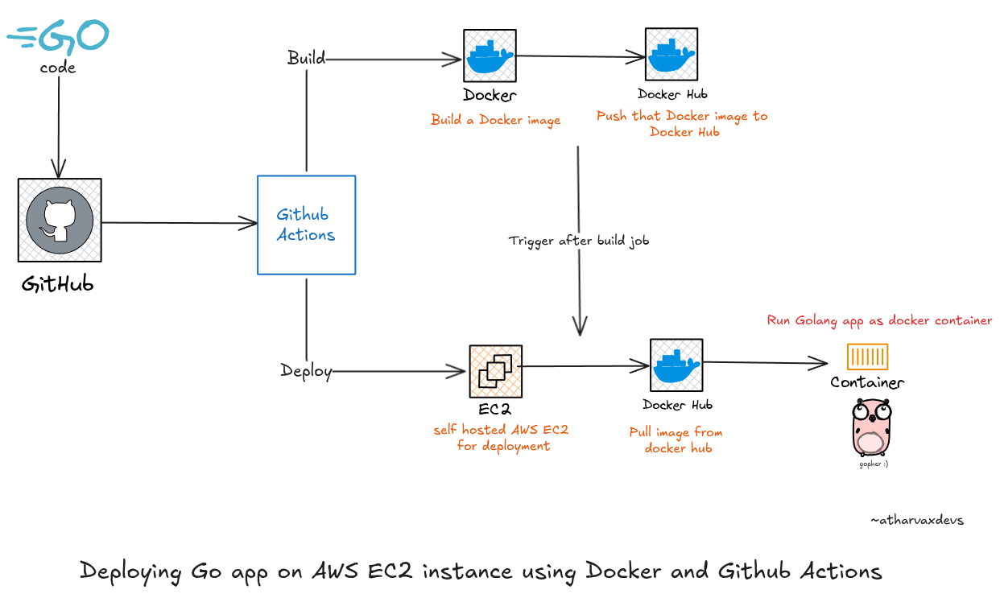

# go-ec2

This project is a hands-on Go HTTP service for tinkering with Docker builds and automated deployments to AWS EC2 via GitHub Actions.

## Architecture (CI/CD)



## What this app does

- **Health endpoint**: `GET /health` returns a JSON health response.
- **Port**: controlled by `PORT` (defaults to `8080`).

## Run locally

```bash
go run .
```

Then open:

- `http://localhost:8080/health`

## Run with Docker

Build:

```bash
docker build -t go-ec2:local .
```

Run:

```bash
docker run --rm -p 8080:8080 --name goapp-container go-ec2:local
```

## CI/CD with GitHub Actions (Docker Hub → EC2)

Workflow file: `.github/workflows/cicd.yml`

### Trigger

- Pushes to the **`deploy-to-ec2`** branch trigger the pipeline.

### Jobs

- **build (GitHub-hosted runner)**:
  - Checks out the repo
  - Logs into Docker Hub
  - Builds `atharvamhaske/go-ec2:latest`
  - Pushes the image to Docker Hub

- **deploy (self-hosted runner on EC2)**:
  - Pulls `atharvamhaske/go-ec2:latest`
  - Removes the old container (if present)
  - Runs the new container on port `8080`

### Required GitHub Secrets

- **`DOCKER_USERNAME`**: Docker Hub username
- **`DOCKER_PASSWORD`**: Docker Hub password or access token
- **`PORT`**: app port (example: `8080`)

## Notes for EC2 (self-hosted runner)

- Install Docker on the EC2 instance
- Configure the GitHub Actions **self-hosted runner** on that instance
- Ensure the EC2 security group allows inbound traffic to **TCP 8080**
